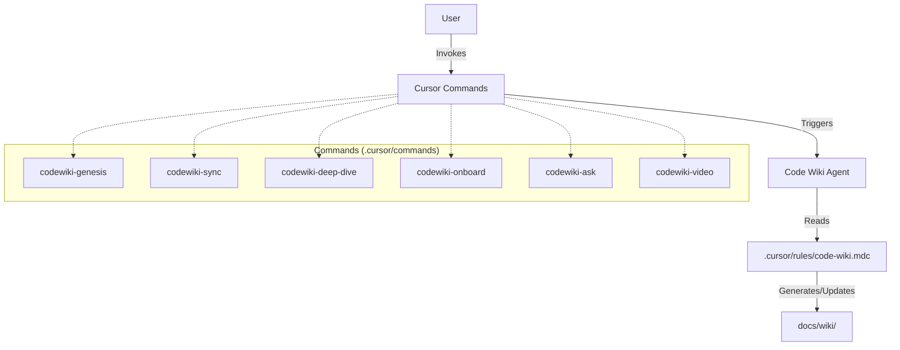

# Cursor Doc Creator

> **The Living Code Wiki System**

This repository contains the configuration files (`.cursor/rules` and `.cursor/commands`) that turn Cursor into a powerful, self-documenting agent. By installing these files into your project, you enable an AI agent to maintain a living "Code Wiki" that stays synchronized with your codebase.

---

## 🚀 Quickstart Guide

### 1. Installation
Copy the `.cursor/` folder from this repository into the root of your project.

### 2. Initialization
Open your project in Cursor and run the Genesis command in the Chat or Command Palette (`Cmd+K` / `Ctrl+K`):

> **/codewiki-genesis**

This will:
1. Scan your repository structure.
2. Create the `docs/wiki/` directory.
3. Generate an initial README, Architecture Diagram, and Component Map.

### 3. Daily Usage

Use these commands to keep your documentation alive:

| Command | Usage | Description |
|:---|:---|:---|
| **/codewiki-sync** | Chat / Cmd+K | **Update Docs.** Scans for code changes and updates impacted wiki pages. Run this before merging PRs. |
| **/codewiki-deep-dive** | `@file` | **Explain Code.** Generates a detailed "Deep Dive" page for a specific file or module, including flow diagrams. |
| **/codewiki-ask** | `"question"` | **Q&A.** Asks the agent a question about the codebase. It answers with code-backed evidence and links to wiki pages. |
| **/codewiki-onboard** | - | **Onboarding.** Generates a `docs/wiki/pages/onboarding.md` guide for new developers (setup, key flows, architecture). |
| **/codewiki-video** | - | **Video Script.** Generates a script and slide outline for a project overview video. |

---

## 🧩 Component Map

| Component | Type | Path | Description |
|-----------|------|------|-------------|
| **Core Rules** | Rule Definition | [.cursor/rules/code-wiki.mdc](.cursor/rules/code-wiki.mdc) | The "Brain". Defines the agent's persona, output format, and "No Hallucination" policy. |
| **Cursor Commands** | Command Collection | [.cursor/commands/](.cursor/commands/) | The "Interface". A suite of markdown files defining the prompts for each user command. |

---

## 🏗️ Architecture

How the pieces fit together:



## 📜 Key Principles (The "Why")

1.  **Code is the Source of Truth**: Documentation should never guess. Every claim must be backed by file links and symbol references.
2.  **Living Documentation**: Docs are useless if they are stale. The `sync` command ensures docs evolve with the code.
3.  **Visual First**: Complex flows are better explained with Mermaid diagrams than walls of text.

---

## 📂 Repository Structure

```text
.
├── .cursor/                 # THE CORE SYSTEM
│   ├── rules/
│   │   └── code-wiki.mdc    # The main rule definition
│   └── commands/            # The command prompt definitions
│       ├── codewiki-genesis.md
│       ├── codewiki-sync.md
│       └── ...
├── docs/wiki/               # Generated Documentation (Example Output)
│   ├── README.md
│   ├── pages/
│   └── diagrams/
└── README.md                # This file
```
