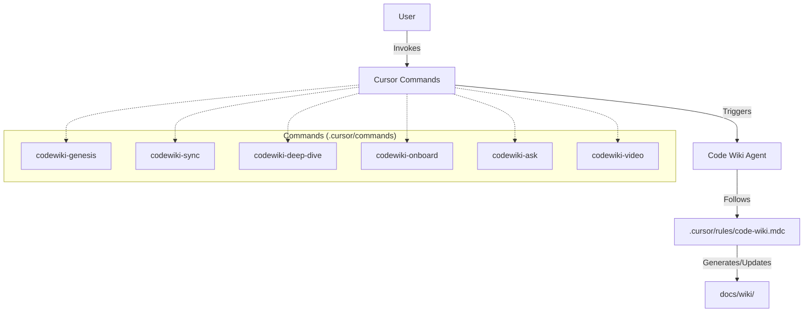

# Code Wiki: cursor-doc-creator

## Overview
This repository hosts the **Code Wiki** system for Cursor. It defines the rules and commands that allow an AI agent to generate and maintain living documentation within a codebase. The system itself is self-contained within the `.cursor` directory.

## Quickstart
Use these commands in the Cursor Command Palette (`Cmd+K` or `Ctrl+K`) or Chat:
- **/codewiki-genesis**: Initialize the wiki structure (you are here).
- **/codewiki-sync**: Update wiki pages after code changes.
- **/codewiki-deep-dive @file**: Generate detailed docs for a specific file.
- **/codewiki-ask "question"**: Ask questions about the codebase with evidenced answers.
- **/codewiki-video**: Generate a video script/outline for the repo.
- **/codewiki-onboard**: Generate an onboarding guide for new devs.

## Component Map
| Component | Type | Path | Description |
|-----------|------|------|-------------|
| **Core Rules** | Rule Definition | [.cursor/rules/code-wiki.mdc](../../.cursor/rules/code-wiki.mdc) | The foundational prompt and behavior rules for the Code Wiki Agent. |
| **Cursor Commands** | Command Collection | [.cursor/commands/](../../.cursor/commands/) | Interface for user interaction, defining tasks like Genesis, Sync, etc. |

## Top Workflows
1.  **Genesis**: Scans the repo and builds the initial `docs/wiki` skeleton.
2.  **Sync**: Updates existing wiki pages when source code changes.
3.  **Deep Dive**: Detailed analysis of a specific component or file.
4.  **Onboard**: Generates a guide for new developers.

## Architecture
High-level interaction between the user, the commands, and the rules.

## Evidence
- `.cursor/rules/code-wiki.mdc`: Defines the agent's behavior and output location.
- `.cursor/commands/*.md`: Specific command files defining user triggers.
